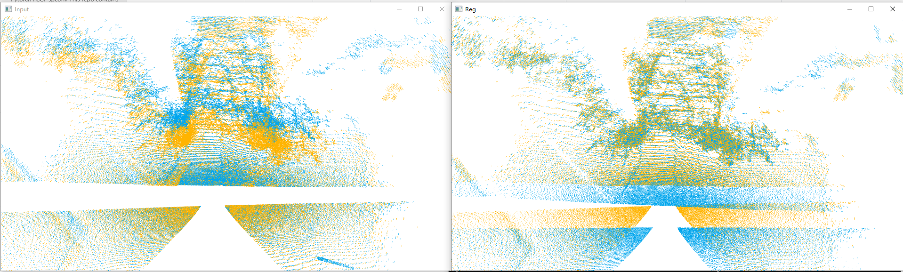
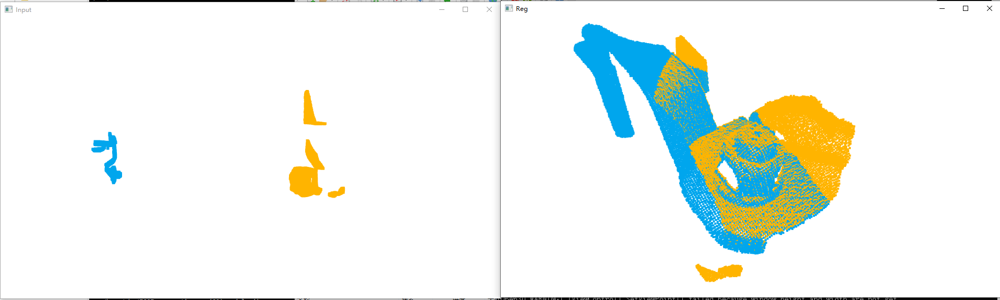

# Pytorch FCGF_spconv

This repo contains an unofficial implementation for [Fully Convolutional Geometric Features (FCGF, ICCV 19)](https://openaccess.thecvf.com/content_ICCV_2019/papers/Choy_Fully_Convolutional_Geometric_Features_ICCV_2019_paper.pdf) based on [spconv v2.1.22](https://github.com/traveller59/spconv) instead of [MinkowskiEngine](https://github.com/NVIDIA/MinkowskiEngine). The original observation is the SLOW training speed during runing the original [FCGF repo](https://github.com/chrischoy/FCGF). As another alternative for sparse convolution, [spconv](https://github.com/traveller59/spconv) has been widely used for tasks such as 3D object detection, etc.  Here we follow the network paradigm of FCGF but build the model using convolutional layers provided by spconv.

### Requirements

```
# pytorch
plyfile
nibabel
easydict
open3d==0.10.0
scipy
tensorboardx
tqdm
```

install above packages by:

```
pip install -r requirements.txt
```

Also, install [spconv](https://github.com/traveller59/spconv) via pip (CUDA11.1):

```
pip install spconv-cu111
```

### Data Preparation

Download the [3DMatch](http://node2.chrischoy.org/data/datasets/registration/threedmatch.tgz) provided by FCGF and organize them as follows:

```
├── FCGF_data  
│   ├──	threedmatch  
        ├── 7-scenes-redkitchen@seq-01_000.npz
        ├── 7-scenes-redkitchen@seq-01_001.npz
        └── ... 
│   ├── threedmatch_test/
        ├── 7-scenes-redkitchen
        ├── 7-scenes-redkitchen-evaluation
        └── ...         
```

### Training on 3DMatch

```
sh scripts/train_3dmatch.sh
```

### Testing on 3DMatch

```
sh scripts/evaluate.sh
```

### Performance

The total training time consumes about:

|   Methods   |       Training Time       |                      Pretrained Weight                       | Epochs |
| :---------: | :-----------------------: | :----------------------------------------------------------: | :----: |
|    FCGF     | ~41.6h (25min per epoch)  | [2019-08-19_06-17-41.pth](https://node1.chrischoy.org/data/publications/fcgf/2019-08-19_06-17-41.pth) |  100   |
| FCGF_spconv | ~11.5 h (23min per epoch) | [ckpt_30.pth](https://drive.google.com/file/d/15Gk2vskOHQMJkuweH5B5_qGZcH2NJKfI/view?usp=sharing) |   30   |

We report **Inlier Ratio**, **Feature Matching Recall** and **Registration Recall** as three main metrics to compare the FCGF_spconv with the original FCGF:

|             Methods             | Voxel Size | sample | Mutual Selection | Inlier Ratio | Feature Matching Recall | Registration Recall |
| :-----------------------------: | :--------: | :----: | :--------------: | :----------: | :---------------------: | :-----------------: |
|          FCGF (paper)           |   0.025    |        |                  |      ~       |          0.952          |        0.82         |
|              FCGF               |   0.025    |   5k   |        ❌         |  **0.341**   |        **0.956**        |       0.8343        |
|           FCGF_spconv           |   0.025    |   5k   |        ❌         |    0.2889    |          0.928          |     **0.8757**      |
| FCGF_spconv (on 3DMatchRotated) |    0.25    |   5k   |        ❌         |    0.0924    |          0.618          |       0.6739        |

### Generalization Ability (From 3DMatch -> ETH)

We test the generalization ability of FCGF_spconv on the challenging outdoor dataset ETH, which is acquired by static terrestrial scanners and dominated by outdoor vegetation, such as trees and bushes. Here we compute the **Feature Matching Recall (mutual)** to show the generalization ability.

Download the [ETH](https://drive.google.com/file/d/1hyurp5EOzvWGFB0kOl5Qylx1xGelpxaQ/view) dataset processed by [YOHO](https://github.com/HpWang-whu/YOHO), then run:

```
python benchmark_ETH.py
```

|   Method    | Gazebo_summer | Gazebo_winter | Wood_autumn | Wood_summer | Average |
| :---------: | :-----------: | :-----------: | :---------: | :---------: | :-----: |
|    FCGF     |     22.8      |     10.0      |    14.8     |    16.8     |  16.1   |
|   D3Feat    |     85.9      |     63.0      |    49.6     |    48.0     |  56.3   |
|   SpinNet   |     92.9      |     91.7      |    92.2     |    94.4     |  92.8   |
|     DIP     |     90.8      |     88.6      |    96.5     |    95.2     |  92.8   |
| FCGF_spconv |     33.7      |     17.3      |    21.7     |    28.0     |  25.2   |

There is a **HUGE** gap between the **patched-based** and **fully-convolutional** based networks with respect to the generalization ability :(

### Registration Demo

modify the **src_path**, **tgt_path**, **voxel_size** as well as **n_sample** in demo.py to register your custom point cloud data.

```
python demo.py
```





### Reference

[FCGF](https://github.com/chrischoy/FCGF), [spconv](https://github.com/traveller59/spconv), [DIP](https://github.com/fabiopoiesi/dip).
